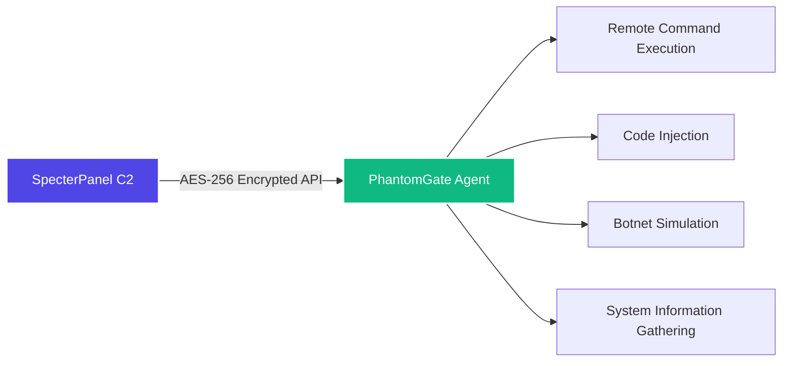

# PhantomGate – because the world definitely needed another RAT

<p align="center">
  
</p>

Oh look, another remote admin tool. How original.  
And yes, it can be used as a botnet client – because that's totally what you're here for, right?  
But before you get any funny ideas (like actually using it on real people), read the warning below.  
I'll wait.

---

## ⚠️ Don't be an idiot (seriously, I mean it this time)

This is for **educational use, authorised red teams, and your own lab only**.  
If you run this on someone's machine without permission, you're breaking the law.  
I'm not your lawyer, I'm not your mom, and I'm definitely not responsible for your stupidity.

You've been warned. Twice now. Three times if you count the title.  
Read it again if you need to. I'll be here. Judging you.

---

## So what does it do? (as if you couldn't guess from the name)

PhantomGate is the agent side of the SpecterPanel C2.  
It runs on Windows, Linux, and even Android (Termux – because apparently phones need botnets too), and talks to the C2 server using AES‑256 encryption. Because security.

You can:
- Execute shell commands remotely (groundbreaking, I know)
- Inject Python code on the fly (so hacker, very 1337)
- Simulate botnet behaviour (UDP floods, SSH brute force – in safe mode if you're not a complete moron)
- Gather system info (because you're nosy and have nothing better to do)
- Run as a background service or with a Kivy GUI (for the button-pushers who fear the terminal)

It's not magic – it's just Python. Calm down. Don't act impressed.

---

## How it talks to the C2 (because you probably don't care but I'm writing it anyway)



Agent polls the server every few seconds, gets instructions, runs them, sends back the output.  
Nothing fancy. It's not AI. It's not blockchain. It's not quantum computing.  
It's just sockets. Boring, reliable, old‑school sockets.

---

## Main features (or "things it does when it's not crashing")

| Module | What it actually does |
|--------|----------------------|
| C2 integration | Connects to SpecterPanel – because reinventing the wheel is for idiots |
| Remote shell | Run any command on the target, get output back (so revolutionary) |
| Code injection | Download and execute Python payloads from the C2 (because why not) |
| Botnet simulation | UDP flood, SSH brute‑force (simulated unless you disable safe mode – don't be stupid) |
| Safe mode | No real damage – just logs what *would* happen (for the responsible adults) |
| SQLite tracking | Keeps state locally so you don't lose history (you're welcome) |
| Cross‑platform | Windows, Linux, Android – same code, same bugs, same tears |
| Kivy GUI | Optional pretty interface for people who don't like terminals |

---

## Architecture (the messy diagram that nobody asked for)

```
                ┌────────────────────────────────────────────────────────┐
                │                   PHANTOMGATE AGENT                    │
                ├────────────────────────────────────────────────────────┤
                │  ┌─────────────────┐      ┌─────────────────────────┐  │
                │  │  C2 Comms       │      │  Command Engine         │  │
                │  │  • Polling      │      │  • Shell execution      │  │
                │  │  • AES encrypt  │◄────►│  • Built‑ins            │  │
                │  │  • Register     │      │  • Output handling      │  │
                │  └─────────────────┘      └─────────────────────────┘  │
                │           ▲                            ▲               │
                │           └──────────┬─────────────────┘               │
                │                      ▼                                 │
                │  ┌─────────────────┐      ┌─────────────────────────┐  │
                │  │  Code Injection │      │  Botnet Engine          │  │
                │  │  • Payload fetch│      │  • UDP flood            │  │
                │  │  • Dynamic exec │      │  • SSH brute            │  │
                │  │  • Output report│      │  • Thread mgmt          │  │
                │  └─────────────────┘      └─────────────────────────┘  │
                │                      │                                 │
                │                   ┌──┴──┐                              │
                │                   │ DB  │                              │
                │                   └─────┘                              │
                │                      │                                 │
                │         ┌────────────┴─────────────┐                   │
                │         │ Headless mode │ GUI mode │                   │
                │         └───────────────┴──────────┘                   │
                └────────────────────────────────────────────────────────┘
                                               │
                                        AES‑256
                                           │
                                    ┌──────▼──────┐
                                    │ SpecterPanel│
                                    └─────────────┘
```

Yes, I know the diagram is a bit extra. It's still useful. Stop complaining.  
I spent like 10 minutes on this. Respect the effort.

---

## Getting it running (without setting your computer on fire)

```bash
git clone https://github.com/omerKkemal/PhantomGate.git
cd PhantomGate

python3 -m venv venv
source venv/bin/activate   # or .\venv\Scripts\activate on Windows

pip install -r requirements.txt

# Edit setting.py – set your C2 URL and API token
nano setting.py

# Run headless
python PhantomGate.py

# Or with GUI
python main.py
```

### Quick install scripts (if you're lazy)

- Linux/macOS: `chmod +x install.sh && ./install.sh` (because you can't figure out chmod)
- Windows: just double‑click `install.bat` (like a real pro) – congrats, you clicked a button

---

## Configuration – setting.py explained (read it or cry later)

You only need to touch a few things. Here's the important stuff. Pay attention. Or don't. I'm not your boss.

```python
class Setting:
    def __init__(self):
        # CHANGE THIS – 16 bytes, keep it secret. Seriously. I mean it.
        self.ENCRYPTION_KEY = b'your-16-byte-key-here'
        
        # Where's your SpecterPanel? (don't use localhost for real ops, genius)
        self.url = 'http://127.0.0.1:5000'
        # API token from SpecterPanel settings (get it yourself, I'm not your assistant)
        self.API_TOKEN = 'your-api-token-here'
        
        # UDP flood targets (ports) – because you'll totally use this responsibly (sure)
        self.PORT = [80, 443, 8080, 22, 3389, 53, 123]
        
        # How often to poll the C2 (seconds) – don't set it too low, idiot
        self.MAIN_LOOP_DELAY = 5
        
        # Safe mode – set to True if you don't want to break things
        # self.SAFE_MODE = True   # uncomment this, you coward
```

Most of the other knobs you can leave alone unless you're tweaking performance – which you probably shouldn't because you'll break something.

---

## How to use it (finally, you made it this far)

### Headless (background agent)

```bash
python PhantomGate.py
# or as a daemon on Linux:
nohup python PhantomGate.py &
# because you're too cool for tmux or screen (I see you)
```

### GUI mode

```bash
python main.py
```

From the GUI you can:
- Add / remove targets in the local DB (wow, so exciting)
- Watch command history (thrilling, I know)
- Start / stop botnet threads (like a real hacker from the movies)
- Browse the SQLite database (because you're a "data analyst" now)

### Commands you can send from the C2 (the part you'll actually use)

| Command | What it does (badly) | Example |
|---------|----------------------|---------|
| `sys_info` | Gather OS, hardware, IP (stalking 101) | `sys_info` |
| `db_info` | Show local DB stats (how exciting) | `db_info` |
| `bot start udp` | Start UDP flood (task id `udp_1`) – don't say I didn't warn you | `bot start udp_1` |
| `bot start brut` | Start SSH brute‑force (so original) | `bot start brut_1` |
| `bot stop <id>` | Stop a thread (because you changed your mind) | `bot stop udp_1` |
| `shell <cmd>` | Run any shell command (the actual useful one) | `shell ls -la` |
| `code exec <name>` | Run an injected payload (for the script kiddies) | `code exec keylogger` |

---

## API endpoints (for the nerds who actually read docs)

The agent calls these on the SpecterPanel server. All traffic is encrypted with AES‑256‑EAX.  
If you send plaintext, the server will ignore you. As it should. Security isn't optional.

| Endpoint | Method | When |
|----------|--------|------|
| `/api/v1.2/register_target` | POST | Once at start |
| `/api/v1.2/ApiCommand/<target>` | GET | Every poll |
| `/api/v1.2/Apicommand/save_output` | POST | After each command |
| `/api/v1.2/BotNet/<target>` | GET | Every poll |
| `/api/v1.2/get_instruction/<target>` | GET | Every poll |
| `/api/v1.2/injection/<target>` | GET | When a payload is requested |
| `/api/v1.2/injection_output_save` | POST | After injection |

The encrypted wrapper looks like this (because you need a visual – I know how you are):

```json
{
    "nonce": "base64...",
    "ciphertext": "base64...",
    "tag": "base64..."
}
```

Read it. Learn it. Love it. Or don't. I don't care.

---

## Safe mode – for the responsible adults who don't want to go to jail

Enable safe mode, and the agent will log what it *would* do without actually doing it.  
It's like a "dry run" for people who don't want to be featured on the evening news.

### How to enable

```bash
# environment variable (if you hate editing files)
export PHANTOMGATE_SAFE_MODE=1
python PhantomGate.py

# or command line (for the fancy people)
python PhantomGate.py --safe-mode

# or just set SAFE_MODE = True in the code (if you're not scared of editing)
```

### What changes (because you'll ask anyway – you always do)

| Action | Normal mode | Safe mode |
|--------|-------------|-----------|
| UDP flood | Actually sends packets (bad) | Logs "would send X packets" (good) |
| SSH brute | Real login attempts (illegal) | Simulates attempts, no network (legal) |
| File writes | Creates/modifies files (risky) | Logs the operation (safe) |
| Registry changes | Writes to registry (oops) | Read‑only, logs changes (whew) |
| Persistence | Installs startup entries (annoying) | Logs what would be installed (polite) |

Example safe mode log (so you can sleep at night):

```
[SAFE MODE] UDP flood prevented: would send 1000 packets to 192.168.1.100:80
[SAFE MODE] File write prevented: would create C:\temp\output.txt
```

Use it in labs. Don't be a hero. Nobody likes a hero.  
Heroes go to jail. Don't go to jail.

---

## Where does it run? (spoiler: almost everywhere – because I hate myself)

| Platform | Status | Notes |
|----------|--------|-------|
| Windows 10/11, Server | ✅ Full | cmd, PowerShell, registry persistence (the usual Windows nonsense) |
| Linux (Ubuntu, Debian, CentOS) | ✅ Full | bash, crontab, daemon mode (so stealthy, much hacker) |
| Android (Termux) | ✅ Full | Limited shell, but hey, it works – good enough for a phone |

The agent auto‑detects the OS and adjusts accordingly.  
Because even I don't want to maintain three separate codebases. I have a life. Sort of.

---

## Related project – SpecterPanel C2 (the other half of this disaster)

This agent is meant to work with **SpecterPanel**, the web‑based C2 server.

- **SpecterPanel** repo: [https://github.com/omerKkemal/oh-tool-v2](https://github.com/omerKkemal/oh-tool-v2)
- It gives you a dashboard, web terminal, code injection UI, and botnet manager.

Together they make a decent C2 stack for red team practice.  
Or for pretending you're a real hacker. Your call. I'm not judging.  
Okay, maybe I'm judging a little.

---

## One more legal thing (because the lawyers made me – I hate lawyers)

You are allowed to use PhantomGate **only** for:

- Authorised penetration tests (with written permission – yes, actually get it in writing)
- Red team exercises in a controlled environment (not your grandma's PC – leave her alone)
- Security research in an isolated lab (not the office network – you'll get fired)
- Learning how C2 frameworks work (because you're here to learn, right? RIGHT?)

You are **not allowed** to:

- Use it on any system you don't own or have explicit permission to test (obviously)
- Use it for criminal activity (really? I have to say this?)
- Distribute modified versions for malicious purposes (don't be that guy – nobody likes that guy)

I've done my part by warning you. The rest is on you.  
Don't make me come over there. I will. I know where you live.

---

## Contributing (you're not going to anyway, but here goes)

Found a bug? Want to add a cool feature? Go ahead. Impress me.

1. Fork the repo (you know how – if not, Google it)
2. Create a branch (`git checkout -b feature/awesome`)
3. Commit your changes (try to make them work – test your code, for once)
4. Push and open a PR (I'll probably merge it if it's not terrible)

Please don't send PRs that remove the safe mode or add truly destructive features – that's not what this project is for.  
This is for learning, not for being a jerk. Read the room.

---

## License

**Educational and authorised research use only** – no commercial license implied.

Copyright © 2024 Omer Kemal.  
No warranty, no liability. If you break it, you keep both pieces.  
If you break the law, you keep the consequences too.  
If you break your computer, that's your problem too.

---

## Author

**Omer Kemal** – security researcher who codes at 3am, regrets it at 9am, and does it again the next night.

- C2 server: [SpecterPanel](https://github.com/omerKkemal/oh-tool-v2)
- Agent: [PhantomGate](https://github.com/omerKkemal/PhontomGate)

Questions? Open an issue. Rude comments? Go touch grass.  
Actually, just go outside. It's nice out there. I promise.  
I'll be here. Alone. With my code. Crying.

---

<p align="center">
  <sub>© 2024 PhantomGate – for learning, not for being a jerk. Seriously. Don't be a jerk. I'm watching you.</sub>
</p>
