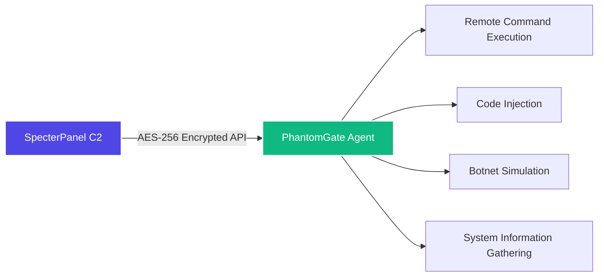

<!--- Animated Header --->
<!-- MAIN TITLE -->
<p align="center">
  
</p>

<!-- MODULE BADGES - CLEAN HEADER -->
<p align="center">
  
  
  
  
  
  
  
</p>

<!-- VERSION BADGES -->
<p align="center">
  
  
  
  
</p>

<!-- REPO STATS -->
<p align="center">
  
  
  
</p>

---

<!-- ASCII ART HEADER -->
<pre align="center">
            ╔═══════════════════════════════════════════════════════════════════╗
            ║  ██████╗ ██╗  ██╗ █████╗ ███╗   ██╗████████╗ ██████╗ ███╗   ███╗  ║
            ║  ██╔══██╗██║  ██║██╔══██╗████╗  ██║╚══██╔══╝██╔════╝ ████╗ ████║  ║
            ║  ██████╔╝███████║███████║██╔██╗ ██║   ██║   ██║  ███╗██╔████╔██║  ║
            ║  ██╔═══╝ ██╔══██║██╔══██║██║╚██╗██║   ██║   ██║   ██║██║╚██╔╝██║  ║
            ║  ██║     ██║  ██║██║  ██║██║ ╚████║   ██║   ╚██████╔╝██║ ╚═╝ ██║  ║
            ║  ╚═╝     ╚═╝  ╚═╝╚═╝  ╚═╝╚═╝  ╚═══╝   ╚═╝    ╚═════╝ ╚═╝     ╚═╝  ║
            ║                                                                   ║
            ║     Multi‑Purpose Remote Administration & Botnet Simulation       ║
            ╚═══════════════════════════════════════════════════════════════════╝
</pre>

---

## CRITICAL NOTICE

<p align="center">
  <table>
    <tr>
      <td align="center" style="background: #1a1a2e; border-left: 6px solid #ff4d4d; border-radius: 10px; padding: 15px;">
        <strong> EDUCATIONAL USE ONLY </strong><br>
        This tool is strictly for <strong>authorized security research, red team exercises, and educational purposes</strong>.<br>
        Unauthorized use is illegal and unethical. Users must comply with all applicable laws.<br>
        <em>The author assumes NO liability for misuse or damages.</em>
      </td>
    </tr>
  </table>
</p>

---

## NAVIGATION MENU

<p align="center">
  <a href="#-overview"></a>
  <a href="#-key-features"></a>
  <a href="#-architecture"></a>
  <a href="#-installation"></a>
  <a href="#-configuration"></a>
  <a href="#-usage"></a>
  <a href="#-api-endpoints"></a>
  <a href="#-safe-mode"></a>
</p>

---

## OVERVIEW

**PhantomGate** is a cross‑platform, modular remote administration tool (RAT) and botnet simulation agent developed for **ethical red teaming, security research, and controlled command‑and‑control (C2) demonstrations**. It works in tandem with **SpecterPanel**, a dedicated C2 server, to provide a modern, extensible framework for understanding and simulating advanced C2 operations in secure, lab‑friendly environments.



---

## KEY FEATURES

<div align="center">
  
| Module | Description |
|:--------|:------------|
| **C2 Integration** | Seamless connection with SpecterPanel C2 server |
| **Remote Command Execution** | Execute shell commands on remote hosts with output reporting |
| **Code Injection** | Download and execute Python payloads from C2 server |
| **Terminal-Web Bridge** | Live remote control via SpecterPanel web interface |
| **Botnet Simulation** | UDP flood testing, SSH brute-force simulation |
| **Safe Mode** | Non-destructive simulation mode for lab environments |
| **SQLite Tracking** | Persistent agent state and command logging |
| **AES-256 Encryption** | All C2 communication encrypted with AES-EAX mode |
| **Cross-Platform** | Runs on Windows, Linux, and Android (Termux) |
| **Kivy GUI** | Optional mobile-style interface for local management |
| **System Info Gathering** | Collect OS, hardware, and network information |
| **Multi-threading** | Concurrent botnet operations with thread management |

</div>

---

## ARCHITECTURE

```
                ┌────────────────────────────────────────────────────────┐
                │                   PHANTOMGATE AGENT                    │
                ├────────────────────────────────────────────────────────┤
                │                                                        │
                │  ┌─────────────────────┐      ┌─────────────────────┐  │
                │  │   C2 COMMUNICATION  │      │   COMMAND ENGINE    │  │
                │  │  • API Client       │      │  • Shell Execution  │  │
                │  │  • AES Encryption   │      │  • Built-in Commands│  │
                │  │  • Polling Loop     │◄────►│  • Output Handling  │  │
                │  │  • Target Register  │      │  • Error Management │  │
                │  └─────────────────────┘      └─────────────────────┘  │
                │            ▲                              ▲            │
                │            │                              │            │
                │            ▼                              ▼            │
                │  ┌─────────────────────┐      ┌─────────────────────┐  │
                │  │   CODE INJECTION    │      │    BOTNET ENGINE    │  │
                │  │  • Payload Fetch    │      │  • UDP Flood        │  │
                │  │  • Dynamic Import   │      │  • SSH Brute Force  │  │
                │  │  • Execution Sandbox│      │  • Thread Manager   │  │
                │  │  • Output Reporting │      │  • Safe Mode Switch │  │
                │  └─────────────────────┘      └─────────────────────┘  │
                │            ▲                              ▲            │
                │            └──────────────┬───────────────┘            │
                │                           │                            │
                │                    ┌──────┴──────┐                     │
                │                    │  SQLite DB  │                     │
                │                    │ • Agents    │                     │
                │                    │ • Commands  │                     │
                │                    │ • Bot State │                     │
                │                    └─────────────┘                     │
                │                           │                            │
                │              ┌────────────┴────────────┐               │
                │              │                         │               │
                │      ┌───────▼───────┐         ┌───────▼───────┐       │
                │      │   HEADLESS    │         │   KIVY GUI    │       │
                │      │    MODE       │         │  (main.py)    │       │
                │      │  Background   │         │  Interactive  │       │
                │      │   Service     │         │  Management   │       │
                │      └───────────────┘         └───────────────┘       │
                │                                                        │
                └────────────────────────────────────────────────────────┘
                                               │
                                        AES-256 Encrypted
                                        JSON over HTTPS
                                               │
                                        ┌──────▼──────┐
                                        │ SpecterPanel│
                                        │    C2       │
                                        └─────────────┘
```

---

## INSTALLATION

```bash
# Clone the repository
git clone https://github.com/omerKkemal/PhantomGate.git
cd PhantomGate

# Create and activate virtual environment
python3 -m venv venv
source venv/bin/activate  # On Windows: venv\Scripts\activate

# Install dependencies
pip install -r requirements.txt

# Configure the agent (edit setting.py)
nano setting.py  # Set C2 URL and API token

# Run the agent (headless mode)
python PhantomGate.py

# OR run with GUI
python main.py
```

### Quick Install Script (Linux/macOS)
```bash
chmod +x install.sh
./install.sh
```

### Quick Install Script (Windows)
```batch
install.bat
```

---

## CONFIGURATION

All settings are managed in `setting.py`. Here's the complete configuration structure:

```python
class Setting:
    def __init__(self):
        # ===== ENCRYPTION =====
        # 16-byte AES key - CHANGE THIS FOR PRODUCTION!
        self.ENCRYPTION_KEY = b'your-16-byte-key-here'
        
        # ===== C2 SERVER =====
        # SpecterPanel URL (no trailing slash)
        self.url = 'http://127.0.0.1:5000'
        # API token from SpecterPanel settings
        self.API_TOKEN = 'your-api-token-here'
        
        # ===== UDP FLOOD SETTINGS =====
        # Target ports for UDP flood
        self.PORT = [80, 443, 8080, 22, 3389, 53, 123]
        # Raw packet headers (customize for simulation)
        self.FAKE_HEADERS = b'\x00\x01\x02\x03\x04\x05\x06\x07'
        # Timing controls (seconds)
        self.BASE_DELAY = 0.1      # Base delay between packets
        self.MAX_DELAY = 5.0       # Maximum random delay
        self.MIN_DELAY = 0.01       # Minimum random delay
        
        # ===== HTTP REQUESTS =====
        # User agents for HTTP requests
        self.USER_AGENTS = [
            'Mozilla/5.0 (Windows NT 10.0; Win64; x64) AppleWebKit/537.36',
            'Mozilla/5.0 (X11; Linux x86_64) AppleWebKit/537.36',
            'Mozilla/5.0 (Macintosh; Intel Mac OS X 10_15_7) AppleWebKit/537.36',
            'Mozilla/5.0 (iPhone; CPU iPhone OS 14_0 like Mac OS X) AppleWebKit/605.1.15',
        ]
        
        # ===== TIMING =====
        # Main loop polling interval (seconds)
        self.MAIN_LOOP_DELAY = 5
        
        # ===== COMMAND CONFIGURATION =====
        # Allowed instruction types from C2
        self.INSTRUCTION = ['command', 'code', 'bot']
        # Botnet action categories
        self.BOT_CATEGORY = ['udp', 'brut']
        # Built-in commands (processed locally)
        self.BUILT_IN_COMMAND = ['sys_info', 'bot', 'db_info']
        
        # ===== DATABASE =====
        # SQLite database path
        self.DB_PATH = 'db/targetData.db'
```

---

## USAGE

### Headless Mode (Background Agent)
```bash
# Start the agent with default settings
python PhantomGate.py

# Run as daemon (Linux)
nohup python PhantomGate.py &
```

### GUI Mode (Kivy Interface)
```bash
# Launch the GUI
python main.py

# GUI Features:
# • Target Management - Add/remove targets from database
# • Status Monitor - View agent health and connectivity
# • Command History - Browse executed commands
# • Thread Control - Start/stop botnet operations
# • Database Viewer - Browse SQLite contents
# • Log Viewer - Real-time log monitoring
```

### Built-in Commands (Sent from C2)

| Command Category | Command | Description | Example |
|:-----------------|:--------|:------------|:---------|
| **System** | `sys_info` | Gather OS, hardware, network info | `sys_info` |
| | `db_info` | Retrieve local database stats | `db_info` |
| | `get_logs` | Fetch recent agent logs | `get_logs 50` |
| **Botnet** | `bot start udp` | Start UDP flood (thread ID: udp_1) | `bot start udp_1` |
| | `bot start brut` | Start SSH brute force | `bot start brut_1` |
| | `bot stop <id>` | Stop specific thread | `bot stop udp_1` |
| | `bot list` | List active threads | `bot list` |
| | `bot status <id>` | Check thread status | `bot status udp_1` |
| **Shell** | `shell <cmd>` | Execute any shell command | `shell ls -la` |
| | `shell powershell <cmd>` | PowerShell on Windows | `shell powershell Get-Process` |
| **Code** | `code exec <name>` | Execute injected code | `code exec keylogger` |
| | `code list` | List available payloads | `code list` |

---

## API ENDPOINTS (SpecterPanel)

The agent communicates with SpecterPanel via these encrypted endpoints. All payloads are wrapped in AES-256-EAX encryption.

### Endpoint Reference

| Endpoint | Method | Frequency | Description |
|:---------|:------:|:---------:|:------------|
| `/api/v1.2/register_target` | `POST` | Once | Register agent with C2 |
| `/api/v1.2/ApiCommand/<target>` | `GET` | Every poll | Fetch pending commands |
| `/api/v1.2/Apicommand/save_output` | `POST` | After command | Submit command output |
| `/api/v1.2/BotNet/<target>` | `GET` | Every poll | Get botnet instructions |
| `/api/v1.2/get_instruction/<target>` | `GET` | Every poll | Get operational instructions |
| `/api/v1.2/injection/<target>` | `GET` | When instructed | Download Python payload |
| `/api/v1.2/injection_output_save` | `POST` | After injection | Submit payload output |

### Encrypted Communication Format

```json
{
    "nonce": "base64_encoded_nonce",
    "ciphertext": "base64_encoded_encrypted_data",
    "tag": "base64_encoded_authentication_tag"
}
```

### Example: Command Output Submission

```python
# Plaintext payload before encryption
{
    "target": "workstation-01",
    "command": "whoami",
    "output": "administrator",
    "status": "success",
    "timestamp": "2024-01-28T14:32:15Z"
}

# Encrypted wrapper sent to C2
{
    "nonce": "a1b2c3d4e5f6...",
    "ciphertext": "Zy8x3kPq9mN...",
    "tag": "7f9a2c4d..."
}
```

---

## CROSS‑PLATFORM COMPATIBILITY

| Platform | Status | Tested Versions | Requirements | Notes |
|:---------|:------:|:----------------|:-------------|:------|
| **Windows** | Full | 10, 11, Server 2019/2022 | Python 3.8+ | Registry persistence, full shell access |
| **Linux** | Full | Ubuntu 20.04+, Debian 11+, CentOS 8+ | Python 3.8+ | Bash/zsh support, daemon mode |
| **Android** | Full | Android 10+ | Termux + Python | Limited shell, file system access |

### Platform Detection
PhantomGate automatically detects the operating system and adjusts:
- **Windows**: Uses cmd.exe or PowerShell, registry for persistence
- **Linux/Unix**: Uses /bin/sh or /bin/bash, crontab for persistence
- **Android**: Detects via environment variables, uses Termux environment

---

## SAFE MODE

For training and lab environments, PhantomGate includes a **Safe Mode** that simulates destructive actions without actual execution.

### Enabling Safe Mode

```python
# Method 1: Environment variable
export PHANTOMGATE_SAFE_MODE=1
python PhantomGate.py

# Method 2: Modify PhantomGate.py (line ~50)
SAFE_MODE = True  # Set to True for simulation

# Method 3: Command line flag
python PhantomGate.py --safe-mode

# Method 4: Configuration file
# Add to setting.py
self.SAFE_MODE = True
```

### Safe Mode Behavior Comparison

| Action | Normal Mode | Safe Mode |
|:-------|:-----------:|:---------:|
| **UDP Flood** | Actual UDP packets sent | Packets logged, no network transmission |
| **SSH Brute Force** | Actual authentication attempts | Credentials logged, connection simulated |
| **File Operations** | Real file creation/modification | Operations logged, no file changes |
| **Registry Changes** | Actual registry modifications | Registry read-only, changes logged |
| **Process Creation** | Real processes spawned | Process creation simulated |
| **Network Connections** | Actual connections made | Connections simulated, no data sent |
| **Persistence** | Adds to startup/registry | Startup methods logged only |

### Safe Mode Logging Example
```
[SAFE MODE] UDP flood prevented: would send 1000 packets to 192.168.1.100:80
[SAFE MODE] SSH brute force simulated: attempted 50 passwords against root@10.0.0.5
[SAFE MODE] File write prevented: would create C:\temp\output.txt
```

---

## RELATED PROJECT

### SpecterPanel C2 Server
The official command‑and‑control server that manages PhantomGate agents.

```
┌─────────────────┐     AES-256      ┌─────────────────┐
│  SpecterPanel   │ ◄──────────────► │  PhantomGate    │
│  C2 Server      │     Encrypted    │  Agent          │
└─────────────────┘     API          └─────────────────┘
```

**Features:**
- Web-based dashboard for agent management
- Real-time command execution
- Code injection panel
- Botnet instruction distribution
- Multi-user support
- API token authentication

**Repository:** [https://github.com/omerKkemal/oh-tool-v2](https://github.com/omerKkemal/oh-tool-v2)

---

## SECURITY & ETHICS NOTICE

PhantomGate is a **powerful tool** with capabilities that include:

### Capabilities
- Remote command execution on target systems
- Python code injection and execution
- Network traffic generation (UDP flood simulation)
- SSH brute-force simulation
- System information gathering
- Persistence mechanisms
- Anti-analysis techniques

### Authorized Use Cases
- enetration testing with written authorization
- Red team exercises in controlled environments
- Security research in isolated labs
- Educational demonstrations
- C2 framework development and testing
- Defense mechanism evaluation

### Unauthorized Use Cases
- Unauthorized access to any system
- Criminal or malicious activities
- Production systems without permission
- Violation of computer fraud laws
- Any use causing harm or damage

### Legal Compliance
Users must comply with:
- Local, state, and federal laws
- Computer Fraud and Abuse Act (CFAA) in the US
- Similar laws in other jurisdictions
- Organizational policies and authorizations

> **BY USING THIS SOFTWARE, YOU ACKNOWLEDGE THAT:**
> - You have read and understood this notice
> - You will only use this software for authorized purposes
> - You accept full responsibility for your actions
> - The author bears no liability for misuse

---

## CONTRIBUTING

Contributions that improve the framework, add new lab scenarios, or fix bugs are welcome.

### Contribution Guidelines

1. **Fork** the repository
2. **Create** a feature branch (`git checkout -b feature/AmazingFeature`)
3. **Commit** your changes (`git commit -m 'Add AmazingFeature'`)
4. **Push** to the branch (`git push origin feature/AmazingFeature`)
5. **Open** a Pull Request

### Contribution Areas
- Bug fixes and performance improvements
- Enhanced encryption or security features
- Additional platform support
- GUI improvements
- Documentation enhancements
- New simulation modules

For major changes, please open an issue first to discuss your ideas.

---

## LICENSE

**Educational and Authorized Research Use Only**

Copyright © 2024 Omer Kemal

This software is provided **solely for educational purposes and authorized security research**. No license, express or implied, is granted for any unauthorized or commercial use.

### Permissions
- Educational use in academic settings
- Authorized penetration testing
- Security research in lab environments
- Personal learning and development

### Restrictions
- No commercial use without explicit permission
- No redistribution for malicious purposes
- No unauthorized deployment
- No modification for illegal activities

**Disclaimer:** This software comes with ABSOLUTELY NO WARRANTY. The author is not responsible for any misuse or damages resulting from the use of this software.

---

## AUTHOR

<div align="center">
  
**Omer Kemal**  
*Security Researcher & Developer*

| Project | Link |
|:--------|:-----|
| **C2 Server** | [SpecterPanel](https://github.com/omerKkemal/oh-tool-v2) |
| **Agent** | [PhantomGate](https://github.com/omerKkemal/PhontomGate) |
| **Purpose** | Security Education & Research |

For questions, feedback, or responsible disclosure, please open an issue on GitHub.

</div>

---

<!-- FOOTER -->
<p align="center">
  
  
  <br>
  <sub>© 2024 PhantomGate. For Authorized Security Research Only.</sub>
</p>
